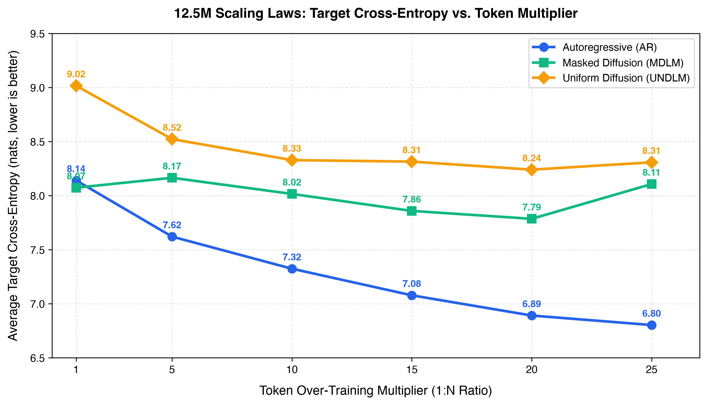
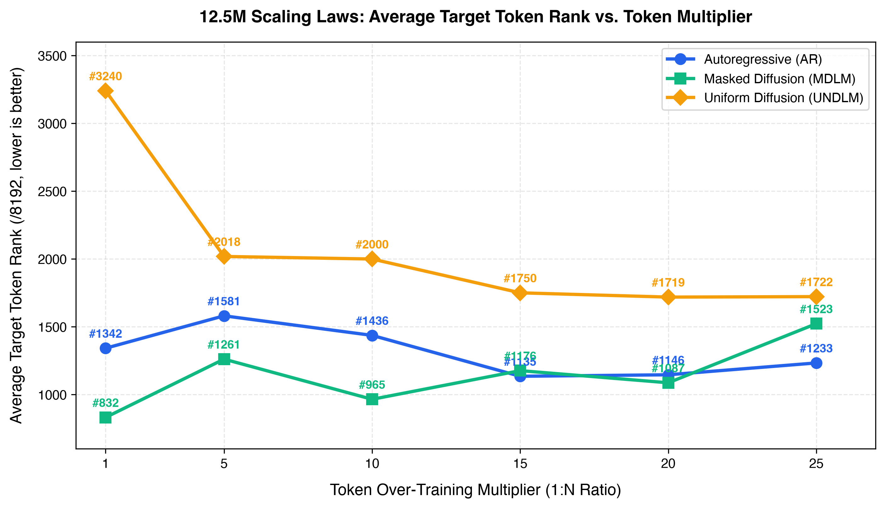
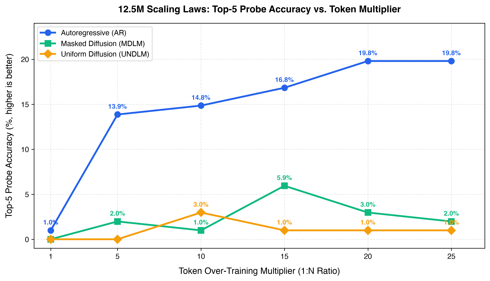

# τέλος (télos) — Exploring Language Modeling Paradigms at Scale

<p align="center">
  <a href="https://telos.research.wingit.tech"><strong> Research Page & Demos: telos.research.wingit.tech</strong></a>
</p>

**τέλος** (or **telos**) is an open-source AI research... thing... by me, designed to systematically evaluate, optimize, and compare foundational language modeling paradigms:
1. **Autoregressive Language Models (AR)** — Standard causal left-to-right next-token prediction.
2. **Masked Diffusion Language Models (MDLM)** — Non-autoregressive generation via continuous absorbing-state ($[\text{MASK}]$) diffusion.
3. **Uniform Noise Diffusion Language Models (UNDLM)** — Non-autoregressive generation via discrete uniform vocabulary corruption with **reversible self-correction**.

All architectures are built from scratch (with help of Opus 4.6, and a lot of research papers), sharing identical transformer backbones (RoPE, SwiGLU, RMSNorm, Weight Tying) and trained under controlled token-to-parameter scaling ratios on Apple Silicon (**Apple MLX / Metal**) and Google Cloud TPUs (**PyTorch-XLA**).


## Current Research includes

1. How well do Masked Diffusion Language Models scale with increase in tokens per parameter?
2. How can we increase the training performance with negligible model quality on MLX *(Apple M series Architecture)* and XLA *(Google TPU Architecture)*?
3. How do AR, MD and UND models compare with each other?
4. How well do Uniform Noise Diffusion Language Models scale with increase in tokens per paramater?
5. How to bring Diffusion Models to a level of Autoregressive models?


## Empirical Scaling Benchmark (12.5M Scale)

Below are the benchmark results evaluated across 12 models trained under identical architectures at the 12.5M scale across token over-training multipliers ($1:1$ up to $1:15$):

### Cross Entropy Scaling


### Average Rank Scaling


### Top 5% Accuracy


### Research Findings

- **Autoregressive (AR)** excel at **mostly everything**.
- **Masked Diffusion (MDLM)** mostly excels at **structural keywords** and bidirectional syntactic constraints.
- **Uniform Noise Diffusion (UNDLM)** exhibits continuous monotonic learning across all categories when evaluated with Monte Carlo noise marginalization, achieving the lowest cross-entropy in **Identifier recovery** (7.96 nats at 1:15). Don't expect quality from this model at all.


## Technical Highlights

- **Unified Transformer Core**: Pre-LayerNorm architecture with **RMSNorm**, **SwiGLU** feed-forward activation, **Rotary Position Embeddings (RoPE)**, and weight-tied embeddings.
- **Continuous Noise Schedules**: Continuous timestep diffusion $t \sim \text{Beta}(\alpha, \beta)$ (default $\text{Beta}(1.5, 1.5)$) ensuring balanced noise allocation between global structure and fine token details.
- **ELBO-Consistent Loss**: Reweighted cross-entropy with $1/t$ timestep weighting matching discrete variational lower bounds.
- **Iterative Inference Samplers**:
  - *MDLM*: Confidence-based iterative unmasking over 16–128 steps with Gumbel noise temperature annealing.
  - *UNDLM*: Self-correcting reverse diffusion with dynamic re-noising and categorical sampling.
- **101 Contextual Probe Suite**: Standardized probing framework evaluating prediction rank, target cross-entropy, Top-1, and Top-5 accuracies across 8 code syntax categories.

## Publications

- **Research and Interactive Demo**: [telos.research.wingit.tech](https://telos.research.wingit.tech)
- **Detailed Deployment Guide**: [DEPLOYMENT.md](DEPLOYMENT.md)

---

## Reproduction (Quickstart)

### 1. Installation
```bash
git clone https://github.com/kazenoko-git/telos.git
cd telos
uv sync  # or: pip install -e . && pip install mlx tokenizers torch pyyaml matplotlib
```

### 2. Training (AR, MDLM, UNDLM)
Train all three paradigms under identical configurations:
```bash
jupyter notebook notebooks/shared/Unified_Training_Suite.ipynb
```

### 3. Evaluate Contextual Probes
Evaluate any trained model checkpoint against the 101-probe suite:
```bash
uv run python notebooks/shared/Evaluation.py --checkpoint checkpoints/masked/12m/telos_12m_r15 --mode probes
```

### 4. Generate Graphs & Visualizations
```bash
uv run python scripts/shared/generate_3paradigm_probe_graphs.py
```

### 5. Quick Inference
```python
from mdiff.hub import TelosModel

model = TelosModel.from_pretrained("checkpoints/masked/12m/telos_12m_r15")
print(model.complete("def fibonacci(n: int) -> int:\n", max_tokens=64))
```

For advanced cluster setups, dataset tokenization, and TPU training, see [DEPLOYMENT.md](DEPLOYMENT.md).

## Citation

```bibtex
@article{samuel2026telos,
  title   = {télos: Exploring Scaling Laws, Hardware Optimizations, and Paradigm Trade-offs in Discrete Diffusion and Autoregressive Language Models},
  author  = {Ivan Samuel},
  journal = {telos Research},
  year    = {2026},
  url     = {https://telos.research.wingit.tech}
}
```

---

## License

Apache-2.0 License. See [LICENSE](LICENSE) for details.

## For the reviewers...

PLEASE state what part you think is AI generated, and why does it look AI generated. NONE of the README is AI generated. I wrote it myself. 😭