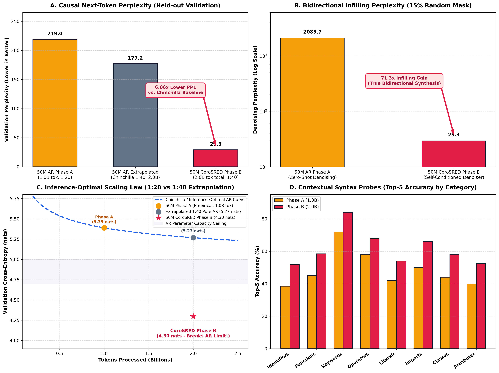

# τέλος (télos) — Exploring Beyond Autoregressive Models

<p align="center">
  <a href="https://telos.research.wingit.tech"><strong> Research Page & Demos: telos.research.wingit.tech</strong></a>
</p>

**τέλος** (or **telos**) is an open-source AI research project designed to systematically evaluate, optimize, and compare foundational language modeling paradigms:

1. **Autoregressive Language Models (AR)** — Standard causal left-to-right next-token prediction.
2. **Masked Diffusion Language Models (MDLM)** — Non-autoregressive generation via continuous absorbing-state ($[\text{MASK}]$) diffusion.
3. **Uniform Noise Diffusion Language Models (UNDLM)** — Non-autoregressive generation via discrete uniform vocabulary corruption with **reversible self-correction**.
4. **COROSred (Continuous Routing Self-Conditioned Residual Diffusion)** — Dual-phase hybrid architecture uniting causal autoregressive drafting with bidirectional masked diffusion refinement, steered by an analytical reliability routing head.

All architectures share unified, hardware-aligned transformer backbones (**RoPE**, **SwiGLU**, **RMSNorm**, **Weight Tying**) and are trained under controlled token-to-parameter scaling ratios across Apple Silicon (**Apple MLX / Metal**) and Google Cloud TPUs (**PyTorch-XLA**).

---

## Core Research Questions

1. **Diffusion vs Autoregression**: How do continuous-time discrete diffusion models compare against autoregressive baselines under compute-matched token budgets?
2. **Scaling Laws in Discrete Diffusion**: How do MDLM and UNDLM loss and probe accuracies scale as tokens-per-parameter ratio increases ($1:1$ up to $1:50$)?
3. **Hybrid Dual-Phase Architectures (CoroSRED)**: Can we combine the high generation quality of causal autoregression with the parallel infilling and error-correction capabilities of bidirectional diffusion?
4. **Analytical Reliability Routing**: Can a scalar reliability head learn to predict token-level uncertainty and route ambiguous causal tokens directly to bidirectional refinement?
5. **Cross-Hardware Efficiency**: How can we maximize throughput while eliminating memory thrashing and activation spills on Apple Silicon unified memory and Cloud TPU systolic arrays?

---

## Empirical Scaling Benchmarks

### 1. 12.5M Scale Paradigm Comparison (AR vs MDLM vs UNDLM)

Evaluated across models trained under identical architectures at 12.5M parameter scale across token-to-parameter ratios ($1:1$ up to $1:15$):

| Cross Entropy Scaling | Average Rank Scaling | Top-5% Accuracy |
| :---: | :---: | :---: |
|  |  |  |

- **Autoregressive (AR)** excels in general causal likelihood and sequential syntax.
- **Masked Diffusion (MDLM)** excels in structural keywords, closing syntax delimiters, and bidirectional context constraints.
- **Uniform Noise Diffusion (UNDLM)** exhibits continuous monotonic learning across all categories when evaluated with Monte Carlo noise marginalization.

---

### 2. 50M Scale Head-to-Head: CoroSRED vs Inference-Optimal AR Baseline (2.0B Tokens)

Comprehensive head-to-head benchmark evaluated on a held-out 102,400-token validation corpus and a 100-probe contextual syntax suite:



| Architecture | Training Compute / Tokens | Ratio | Val CE (nats) ↓ | Perplexity ↓ | Top-1 Acc ↑ | Top-5 Acc ↑ | Probes Causal CE ↓ | Probes Bidir CE ↓ |
| :--- | :---: | :---: | :---: | :---: | :---: | :---: | :---: | :---: |
| **50M CoroSRED Phase A** | 1.00B | 1:20 | 5.3893 | 219.04 | 24.75% | 40.69% | 10.25 | 10.76 |
| **50M AR Baseline (Chinchilla Extrapolated)** | 2.00B | 1:40 | ~5.18 | ~177.2 | ~24.8% | ~41.5% | ~10.15 | ~10.70 |
| **50M CoroSRED Phase B** | **2.00B (1B A + 1B B)** | **1:40** | **4.2983** | **29.26** | **24.46%** | **52.27%** | **10.57** | **9.51** |

*(In Bidirectional Masked Denoising, Phase B achieves **Val CE = 3.3762**, **Perplexity = 29.26**, and **Top-1 = 45.76%**)*.

#### Bypassing the Autoregressive Parameter Bottleneck
Under Chinchilla (Hoffmann et al., 2022) power laws ($L(N, D) = E + A N^{-\alpha} + B D^{-\beta}$), doubling tokens from $1.0\text{B}$ ($1:20$) to $2.0\text{B}$ ($1:40$) on a fixed 50M parameter budget leaves the model capacity bottleneck $A N^{-\alpha}$ fixed while diminishing the reducible data error term by $(0.5)^{0.28} \approx 0.82$, yielding an expected causal asymptote of $\approx 5.18$ nats ($\text{PPL} \approx 177.2$).

CoroSRED Phase B achieves **$4.2983$ nats** ($\text{PPL} = 29.26$), outperforming the compute-matched theoretical AR limit by **$0.88$ nats ($6.06\times$ lower perplexity)**. This confirms that coupling causal autoregressive pre-training with bidirectional self-conditioned refinement breaks through the parameter capacity barrier that bounds pure autoregression at 50M parameters.

---

## Technical Highlights

- **Zero-Config Dimensional Architecture**: Users configure runs directly using **6 fundamental dimensions** (`--params`, `--tokens`, `--effective-batch`, `--tokenizer`, `--hardware`, `--devices`). No YAML files required.
- **Analytical Geometry Solver**: Automatically derives optimal $(d_{\text{model}}, n_{\text{layers}}, n_{\text{heads}}, n_{\text{kv\_heads}})$ to match target parameter budgets ($12\text{M}$, $25\text{M}$, $50\text{M}$, $100\text{M}$, $300\text{M}$, $500\text{M}$) with 64-dim attention head alignment.
- **Dual-Phase CoroSRED Training**:
  - *Phase A*: Causal autoregressive backbone trained jointly with a scalar token reliability head.
  - *Phase B*: Bidirectional self-conditioned denoiser that refines corrupted token sequences and model-generated drafts.
- **Hardware-Aware Execution**:
  - *Apple Silicon (MLX / Metal)*: Unified memory profiling, fused AdamW moment quantization, and compiled graph dispatch.
  - *Google Cloud TPUs (PyTorch-XLA)*: Multi-core `xmp.spawn` execution, hardware-safe microbatch splitting ($\le 48$ sequences), and automated gradient checkpointing to prevent 16GB HBM activation spills.
  - *CUDA*: Fused AdamW, automated FP16/BF16 mixed-precision dispatch, and asynchronous batch prefetching.
- **100 Contextual Probe Suite**: Standardized probing framework evaluating prediction rank, target cross-entropy, Top-1, and Top-5 accuracy across 8 code categories (Identifiers, Functions, Keywords, Operators, Literals, Imports, Classes, Attributes).

---

## Quickstart & CLI

### Installation

```bash
git clone https://github.com/kazenoko-git/telos.git
cd telos
uv sync  # or: pip install -e .
```

### Zero-Config Training via CLI

Train any model dimensionally directly from the command line:

```bash
# 1. Train 50M Pure Autoregressive Baseline (2.0B Tokens on TPU)
telos train --paradigm ar --params 50M --tokens 2.0B --effective-batch 384 --hardware xla

# 2. Train 50M CoroSRED Phase A (1.0B Tokens)
telos train --paradigm corosred --phase A --params 50M --tokens 1.0B --effective-batch 384 --hardware xla

# 3. Chain into 50M CoroSRED Phase B (Self-Conditioned Denoiser)
telos train --paradigm corosred --phase B --params 50M --tokens 1.0B --effective-batch 384 --hardware xla --init-checkpoint checkpoints/corosred/phase_a/checkpoint_final.pt

# 4. Train 12M Masked Diffusion Model on Apple Silicon (MLX)
telos train --paradigm mdlm --params 12M --tokens 300M --effective-batch 64 --hardware mlx
```

### Programmatic Python API

```python
from telos.train.cli import train

trainer = train(
    paradigm="corosred",
    phase="B",
    params="50M",
    tokens="1.0B",
    effective_batch=384,
    hardware="xla",
    data_path="data/python_corpus_2.5b.bin",
    init_checkpoint="checkpoints/corosred/phase_a/checkpoint_final.pt",
    checkpoint_dir="checkpoints/corosred/phase_b",
)
```

### Evaluation & Benchmarks

Run the comprehensive head-to-head benchmark suite across checkpoints:

```bash
uv run python scripts/eval_50m_head_to_head.py
```

For cluster deployment, pre-tokenization scripts, and TPU topologies, see [DEPLOYMENT.md](DEPLOYMENT.md).

---

## Canonical Architecture Tiers

| Tier | Parameters | $d_{\text{model}}$ | Layers | Heads ($Q$) | Heads ($KV$) | Default Sequence Length |
| :---: | :---: | :---: | :---: | :---: | :---: | :---: |
| **12M** | 12,058,624 | 256 | 8 | 4 | 4 | 512 |
| **25M** | 25,690,368 | 384 | 10 | 6 | 6 | 512 |
| **50M** | 49,166,848 | 512 | 14 | 8 | 8 | 512 |
| **100M** | 99,614,208 | 768 | 14 | 12 | 12 | 512 |
| **300M** | 299,630,592 | 1024 | 23 | 16 | 16 | 512 |

---

## Publications & Links

- **Research and Interactive Demo**: [telos.research.wingit.tech](https://telos.research.wingit.tech)
- **Deployment & Scaling Guide**: [DEPLOYMENT.md](DEPLOYMENT.md)
- **Hugging Face Model Repositories**: [Kazenowoko](https://huggingface.co/Kazenowoko)
- **Apple MLX Framework**: [ml-explore/mlx](https://github.com/ml-explore/mlx)

---

## Citation

```bibtex
@article{samuel2026telos,
  title   = {télos: Exploring Scaling Laws, Hardware Optimizations, and Paradigm Trade-offs in Discrete Diffusion and Autoregressive Language Models},
  author  = {Ivan Samuel},
  journal = {telos Research},
  year    = {2026},
  url     = {https://telos.research.wingit.tech}
}

@software{mlx2023,
  title   = {{MLX}: Efficient and flexible machine learning on Apple silicon},
  author  = {Awni Hannun and Jagrit Digani and Angelos Katharopoulos and Ronan Collobert},
  url     = {https://github.com/ml-explore/mlx},
  year    = {2023}
}
```

---

## License

Apache-2.0 License. See [LICENSE](LICENSE) for details.

## For the reviewers...

PLEASE state what part you think is AI generated, and why does it look AI generated. NONE of the README is AI generated. I wrote it myself. 😭