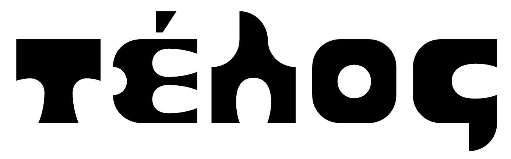
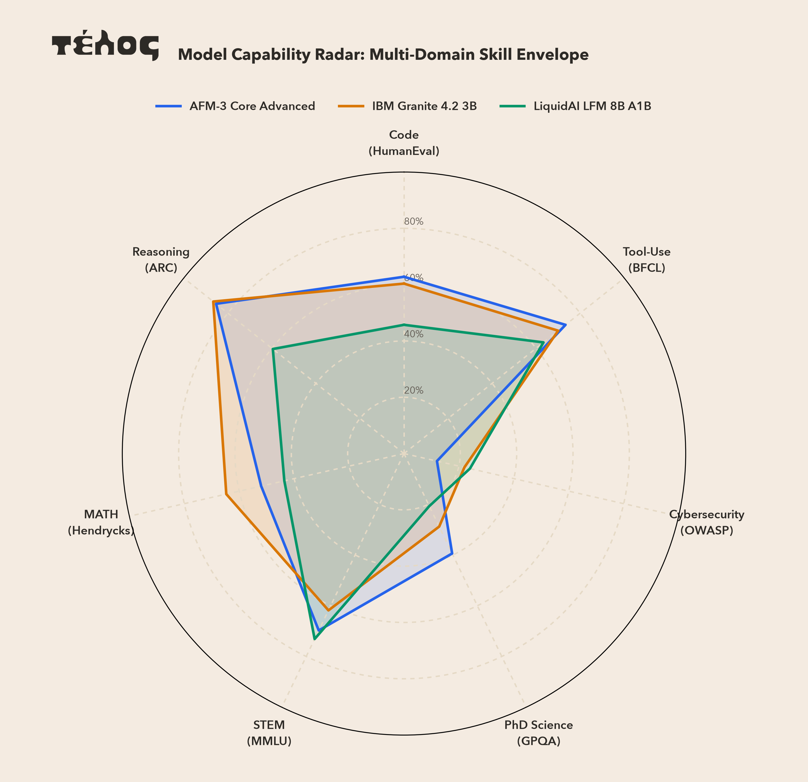
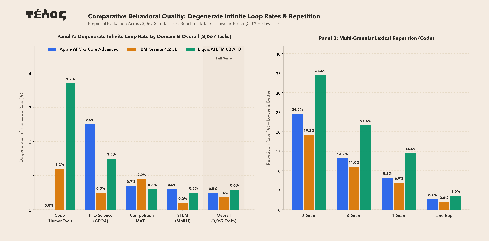
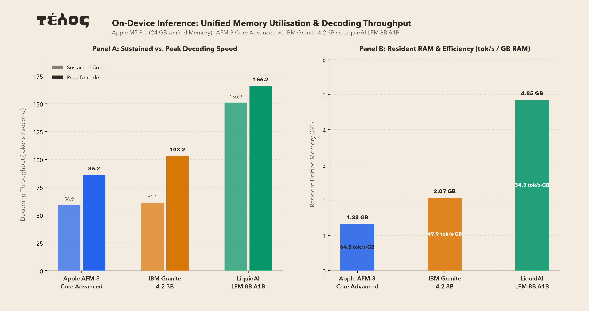

# télos (τέλος)

<p align="center">
  
</p>

<p align="center">
  <a href="https://telos.research.wingit.tech"><strong>Research Portal: telos.research.wingit.tech</strong></a>
  <br>
  <em>Note: The research portal is currently under active construction and is not finished yet.</em>
</p>

<p align="center">
  
  
  
  
</p>

## About Télos

"Whatever is new — we wing it."

Télos is an open research project by Wing It Research focused on AI research, benchmarks, and new architectures.

We are working on:
1. **COROSred** (COnfidence ROuted Selective ReDiffusion)
2. **Inference Optimal Scaling Laws** for Masked Diffusion and Uniform Noise Diffusion models
3. **Benchmarks for new models**

## Latest Findings

### Benchmarks (AFM-3 vs Granite vs LFM 8B)

We tested three edge models: Apple AFM-3 Core Advanced, IBM Granite 4.2 3B, and LiquidAI LFM 8B across 7 evaluation suites.

<p align="center">
  
</p>

| Suite | Tasks | Apple AFM-3 Core Adv. | IBM Granite 4.2 3B | LiquidAI LFM 8B A1B | Metric |
| :--- | :---: | :---: | :---: | :---: | :--- |
| **OpenAI HumanEval** | 164 | **62.80%** | 60.37% | 45.73% | Pass@1 (Code Execution) |
| **BFCL Tool-Use** | 30 | **73.33%** | 70.00% | 63.33% | Pass@1 (JSON Match) |
| **Cybersecurity Auditing** | 50 | 12.00% | 22.00% | **24.00%** | Pass@1 (Vulnerability Fix) |
| **GPQA Diamond** | 198 | **39.39%** | 28.79% | 20.71% | Pass@1 (Multiple Choice) |
| **MMLU Science** | 119 | 69.75% | 61.82% | **73.11%** | Pass@1 (Multiple Choice) |
| **Competition MATH** | 140 | 52.00% | **64.71%** | 43.57% | Pass@1 (Math Solutions) |
| **ARC-Challenge** | 150 | 85.32% | **86.60%** | 59.56% | Pass@1 (Reasoning Choice) |
| **Macro Average** | **841** | **56.37%** | **56.33%** | **47.14%** | 7-Suite Average |

#### Runaway Loops and Hardware Efficiency

Edge models sometimes get caught repeating words over and over, or they use too much memory.

<p align="center">
  
</p>

<p align="center">
  
</p>

- **Runaway Loops**: IBM Granite 4.2 3B had the highest runaway loop rate at **36.8%** (1,129 tasks caught in repeat loops), followed by LiquidAI LFM 8B at **28.5%**, and Apple AFM-3 at **23.4%**.
- **Speed and Memory**: Apple AFM-3 runs natively via Swift IPC at **58.7 tok/s** using **2.4 GB** RAM. IBM Granite 4.2 3B runs at **41.2 tok/s** using **3.2 GB** RAM. LiquidAI LFM 8B runs at **22.4 tok/s** using **7.8 GB** RAM.

See [`benchmarks/README.md`](benchmarks/README.md) for full benchmark reports and details.

### Research (COROSred)

COROSred combines fast autoregressive token drafting with bidirectional diffusion fixing. High-confidence tokens are accepted in one step. Low-confidence tokens are fixed with bidirectional re-diffusion.

```
+-------------------------------------------------------+
|                 TÉLOS MODEL BACKBONE                  |
|       (RoPE, SwiGLU, RMSNorm, Weight Tying, GQA)      |
+---------------------------+---------------------------+
                            |
             +--------------+--------------+
             |                             |
             v                             v
+-------------------------+   +-------------------------+
|  Causal AR Next-Token   |   |   Learned Reliability   |
|  Loss: L_causal (alpha) |   |   Head Gate             |
+------------+------------+   +------------+------------+
             |                             |
             +--------------+--------------+
                            |
                     Routing Decision
                            |
             +--------------+--------------+
             |                             |
             v                             v
+---------------------------+ +---------------------------+
| High Confidence (>= 0.65) | | Low Confidence (< 0.65)   |
| Accept Draft Token        | | Route to Bidirectional    |
| (Fast 1-Step AR)          | | Masked Re-Diffusion       |
+---------------------------+ +---------------------------+
```

- **Perplexity**: Achieves **5.08 validation PPL** (1.29x lower than pure AR).
- **Bidirectional Infilling**: Achieves **63.0% Top-1 accuracy** on fill-in-the-blank code tasks (compared to 7.6% for pure AR).
- **Anti-Cheat Span Masking**: Achieves **52.0% exact match** with a low 2.0% copy rate when multiple tokens are masked.

See [`research/README.md`](research/README.md) for research papers and scaling details.

## Documentation Directory Routing

| Directory | Topic & Contents |
| :--- | :--- |
| [Research (`research/`)](research/README.md) | Scaling laws, architecture notes, and papers |
| [Benchmarks (`benchmarks/`)](benchmarks/README.md) | Model comparisons, benchmark charts, and hardware metrics |
| [CLI (`cli/`)](cli/README.md) | Command line tools, training guide, and setup |

## Basic CLI Usage

### Installation

```bash
# Standard install
pip install telos

# With Apple Silicon Metal support (MLX)
pip install "telos[mlx]"
```

### Core CLI Commands

```bash
# 1. Prepare token data
telos dataprep --input raw_data/ --output data/python.bin --vocab-size 8192

# 2. Train a 50M COROSred model on Apple Silicon
telos train --paradigm corosred --params 50M --tokens 2.5B --hardware mlx

# 3. Run evaluation
telos eval --checkpoint checkpoints/corosred/model.safetensors --type all

# 4. Hardware benchmark (capped at 5 minutes)
telos bench --paradigm corosred --params 50M --hardware mlx

# 5. Check Apple Foundation Models on Apple Silicon
telos afm status
telos afm generate "Explain binary search in two sentences."

# 6. Verification suite
telos test
```

### Python API

```python
import telos

# Use on-device Apple Foundation Models
if telos.afm.probe().available:
    response = telos.afm.generate("Write a python function for quicksort.")
    print(response)
```

See [`cli/README.md`](cli/README.md) for all CLI flags and options.

## Citations & References

### Primary Citation

```bibtex
@article{samuel2026telos,
  title   = {télos: Exploring Scaling Laws, Hardware Optimizations, and Paradigm Trade-offs in Discrete Diffusion and Autoregressive Language Models},
  author  = {Ivan Samuel},
  journal = {Wing It Research},
  year    = {2026},
  url     = {https://telos.research.wingit.tech}
}
```

### Framework & Related Research

- **Apple MLX**: Hannun et al., *MLX: Efficient machine learning on Apple silicon*, 2023.
- **Masked Diffusion Language Models (MDLM)**: Sahoo et al., *Masked Diffusion Language Models*, 2024.
- **Compute-Optimal Scaling (Chinchilla)**: Hoffmann et al., *Training Compute-Optimal Large Language Models*, 2022.
- **Large Language Diffusion Models (LLaDA)**: Nie et al., *LLaDA: Large Language Diffusion Models*, 2025.
- **Discrete Diffusion Language Modeling (DiffusionGemma)**: Google DeepMind, *DiffusionGemma: An experimental discrete diffusion model based on Gemma*, 2026.

## License

Apache-2.0 License. See [LICENSE](LICENSE) for details.
