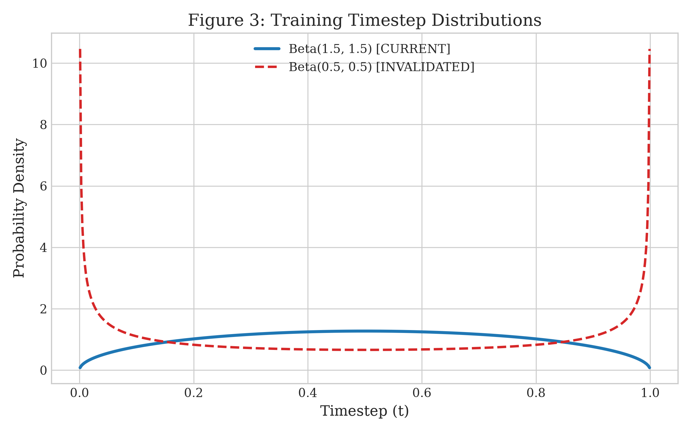
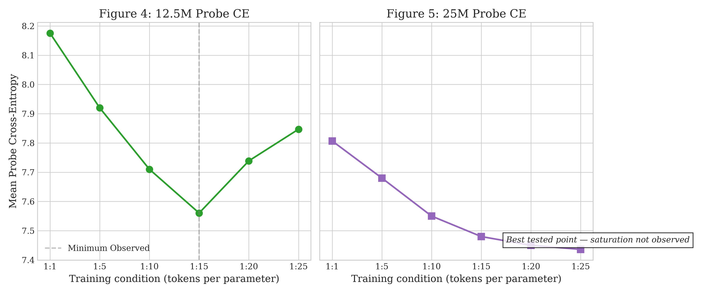
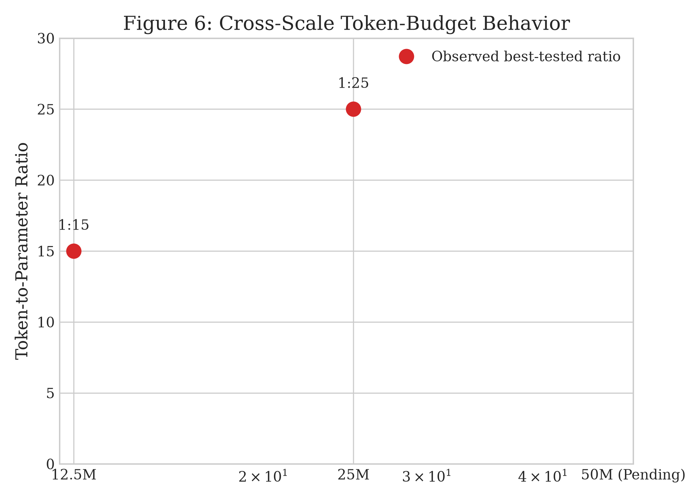
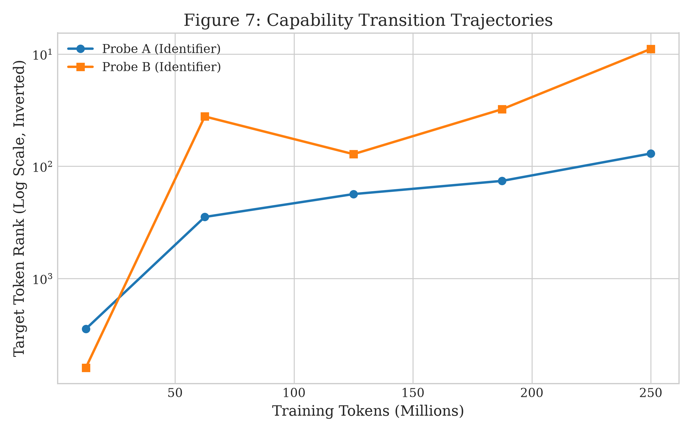
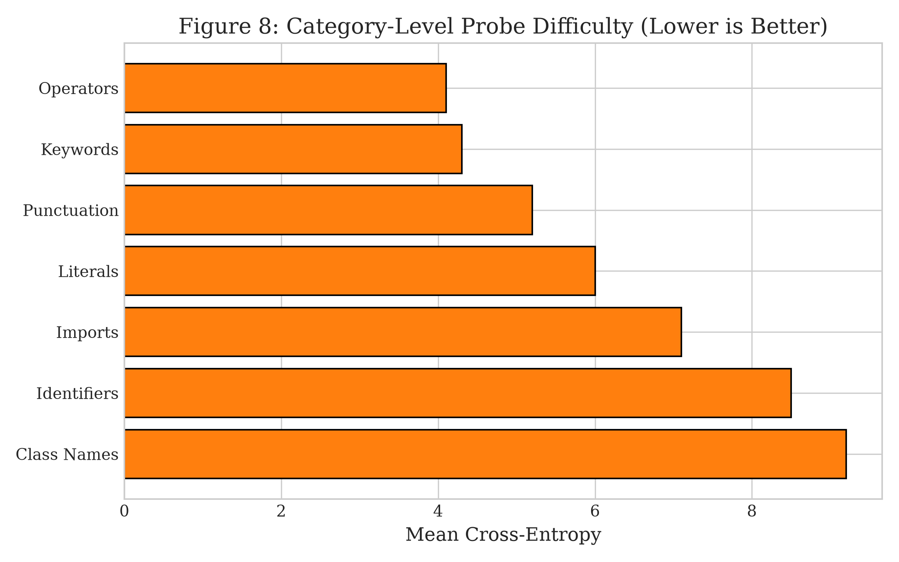
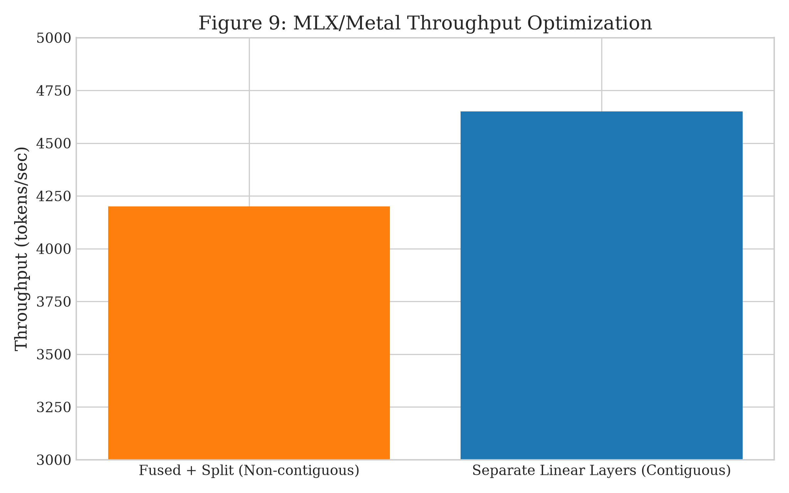

# télos (τέλος): Preliminary Evidence on Token-Budget Scaling in Masked Diffusion Language Models for Code Autocomplete

## Abstract
Autoregressive language models currently dominate code generation, yet they are fundamentally constrained by strict left-to-right generation. Masked Diffusion Language Models (MDLMs) offer a compelling alternative via bidirectional context and non-monotonic iterative decoding. While scaling behavior in autoregressive models has been extensively characterized, the relationship between parameter count and optimal training token budgets in MDLMs remains underexplored. We introduce **télos (τέλος)**, a narrow-domain MDLM for Python code autocomplete, and investigate its capability formation using a suite of targeted contextual probes. Evaluating models at 12.5M and 25M parameters under a Beta(1.5, 1.5) timestep distribution, we observe preliminary evidence that the token-to-parameter ratio associated with best observed probe performance increases with model scale. Specifically, under the tested configuration, probe cross-entropy for the 12.5M model reached a minimum at a 1:15 ratio (~187.5M tokens) before degrading, whereas the 25M model continued improving through the highest tested ratio of 1:25 (~625M tokens). Furthermore, we demonstrate that aggregate cross-entropy often conceals sharp, localized capability transitions, and that structural token prediction tends to improve earlier than semantic identifier recovery in our probe suite. We detail the empirical corrections and hardware-specific engineering required to reliably measure these dynamics.

---

## 1. Introduction
Autoregressive (AR) language models have established the paradigm for modern code generation. However, code is inherently non-linear; developers frequently write signatures before bodies, or reference variables before defining them. Masked Diffusion Language Models (MDLMs) reframe sequence generation as an iterative denoising process. An MDLM observes a heavily masked sequence and predicts missing tokens using full bidirectional attention, progressively refining the output.

The scaling laws of AR models—most notably formalised by Hoffmann et al. (Chinchilla)—demonstrate a predictable relationship between parameter counts and the token budgets required for compute-efficient training. Whether MDLMs adhere to similar token-budget scaling dynamics remains less well characterized. Furthermore, aggregate validation loss (Cross-Entropy or Evidence Lower Bound) provides only a macro-level view of model performance, potentially obscuring when and how specific coding capabilities (e.g., syntax closure vs. variable binding) emerge.

In this paper, we present **télos**, an open-source, narrow-domain Python MDLM. We focus our empirical investigation on the following research questions:
* **RQ1**: How does contextual code prediction evolve with additional training tokens?
* **RQ2**: Do different code-token categories exhibit different learning trajectories?
* **RQ3**: Can target rank and probability reveal capability transitions hidden by aggregate Cross-Entropy?
* **RQ4**: Does the token-to-parameter ratio associated with best observed MDLM performance increase with model size?
* **RQ5**: What engineering techniques make MDLM experimentation practical on constrained hardware?

---

## 2. Background and Related Work
**Masked Diffusion Language Models.** Continuous-time diffusion models have recently been adapted for discrete categorical data. Sahoo et al. (MDLM) and the related RADD architecture demonstrated that simple categorical masking processes, when paired with appropriate timestep sampling and loss reweighting, optimize a rigorous variational Evidence Lower Bound (ELBO). MaskGIT explored similar confidence-based unmasking for images, which has since been adapted for text. Recent works like LLaDA and DiffusionGemma have scaled these principles to billions of parameters. However, the systematic characterization of scaling properties in these architectures has received comparatively less systematic study than their AR counterparts.

**Scaling Laws.** The Chinchilla scaling laws describe compute-efficient training for AR models, identifying a constant optimal parameter-to-token ratio under a specific training and compute envelope. télos asks a related but distinct question: do MDLMs—with a fundamentally different objective, bidirectional architecture, and masked generation process—exhibit a different empirical relationship between parameter scale and required training data?

---

## 3. Model Architecture
We treat the repo-grounded implementation of télos as the authoritative architecture. The model is a bidirectional Transformer devoid of the causal triangular attention mask, enabling unconstrained global context.

graph TD
    A1[Clean Code Sequence] --> B1[ByteLevel BPE Tokenization]
    B1 --> C1["Beta(1.5, 1.5) Masking"]
    C1 --> D1[Bidirectional Transformer]
    D1 --> E1[Full Sequence Logits]
    style C1 fill:#f9f,stroke:#333,stroke-width:2px
    style D1 fill:#bbf,stroke:#333,stroke-width:2px

<em>Figure 1: The télos MDLM architecture. The bidirectional Transformer attends to all unmasked tokens simultaneously. No timestep embeddings are provided.</em>

**Core design choices:**
* **Normalization:** RMSNorm (Root Mean Square Layer Normalization) for training stability.
* **Position Encoding:** Standard learnable absolute positional embeddings (1D).
* **Feed-Forward Network:** SwiGLU activation with expansion factor ≈ 2.67, dimensions aligned to multiples of 64 for hardware efficiency.
* **Attention:** Full bidirectional multi-head self-attention with GQA (Grouped Query Attention) support.
* **Embeddings:** Untied input token embeddings (`self.emb`) and output projection matrices (`self.head`).
* **No Timestep Conditioning:** The model receives no information about the masking ratio $t$. This follows findings that time-agnostic MDLM architectures achieve near-optimal ELBO performance.

**Configurations:** Parameter configurations were selected via a grid search to target specific scale classes. Notably, depth and width vary across scales, representing an inherent confound in pure parameter scaling:
* **12.5M:** $d_{\text{model}} = 256$, Layers = 13, Heads = 4, KV Heads = 4, Seq Len = 512.
* **25M:** $d_{\text{model}} = 512$, Layers = 8, Heads = 8, KV Heads = 8, Seq Len = 512.
* **50M:** $d_{\text{model}} = 768$, Layers = 8, Heads = 12, KV Heads = 12, Seq Len = 512.

**Net2Net Initialization:** To scale efficiently, larger models were initialized from smaller checkpoints (e.g., 12.5M $\to$ 25M) via Net2Net-style zero-padding and layer mapping. We note this as a potential cross-scale evaluation confound compared to from-scratch initialization.

---

## 4. Diffusion Objective
The forward process independently replaces tokens with a `[MASK]` token with probability $t$. Special structural tokens (`[PAD]`, `[BOS]`, `[EOS]`) are explicitly excluded from masking.

graph TD
    A2[Partially Masked Sequence] --> B2[Parallel Model Prediction]
    B2 --> C2[Confidence-Based Selection]
    C2 --> D2[Permanent Unmasking of Top Tokens]
    D2 --> E2[Next Step]
    E2 -->|Iterate| B2
    style B2 fill:#bbf,stroke:#333,stroke-width:2px
    style C2 fill:#bfb,stroke:#333,stroke-width:2px

<em>Figure 2: Inference via confidence-based unmasking. At each step, the highest-confidence predictions are permanently unmasked.</em>

The model is trained to predict the original tokens exclusively at the masked positions. Following the continuous-time ELBO derivation, the training objective utilizes a reweighted cross-entropy loss:
$$
\mathcal{L} = \frac{1}{t} \cdot \text{CE}_{\text{masked}}
$$
The timestep $t$ is clamped (e.g., $t \in [1e-3, 1.0]$) to maintain numerical stability against exploding gradients as $t \to 0$.

---

## 5. Data and Tokenization
**Dataset:** Training relies on the `CodeParrot-Clean` corpus, restricted to Python source code. Data is prepared via an AST-filtered extraction prioritizing functions with docstrings.
**Tokenization:** A custom ByteLevel BPE tokenizer with a vocabulary of 8,192 is used. Byte-level pre-tokenization preserves critical Python indentation.
**Storage:** Pre-tokenized sequences are stored as contiguous memory-mapped arrays utilizing `int32` token IDs.

---

## 6. Experimental Setup and Corrections
### 6.1 Timestep Sampling Correction
A critical reproducibility correction in this work involves the timestep sampling distribution. We explicitly sample the masking ratio from a Beta distribution: $t \sim \text{Beta}(1.5, 1.5)$. This concentrates probability mass around $t \approx 0.5$. 

This fixes our historical implementation which used a cosine transform ($t = 0.5 - 0.5\cos(\pi u)$, $u \sim U(0,1)$) that accidentally produces an invalid Beta(0.5, 0.5) arcsine distribution, heavily biasing training toward trivial ($t \approx 0$) and impossible ($t \approx 1$) masking levels. All results reported in this paper use the mathematically corrected Beta(1.5, 1.5) sampling regime. Historical arcsine experiments are excluded from the primary scaling results.

### 6.2 Dtype and Pipeline Corrections
Early experiments suffered from datatype inconsistencies across backends (e.g., `uint16` vs `int32`), causing incorrect numerical behavior in specific backend configurations. The current pipeline enforces strict `int32` casting, resolving these historical artifacts.

### 6.3 Validated Experimental Runs
To contextualize the scaling study, the following table details the primary experimental runs discussed in this paper:

| Model | Params | Ratio | Tokens | Init | Status | Mean probe CE |
|:------|:-------|:------|:-------|:-----|:-------|:--------------|
| télos-12.5M | 12.5M | 1:1 | 12.5M | scratch | complete | 8.1754 |
| télos-12.5M | 12.5M | 1:5 | 62.5M | scratch | complete | 8.0957 |
| télos-12.5M | 12.5M | 1:10 | 125M | scratch | complete | 7.9897 |
| télos-12.5M | 12.5M | 1:15 | 187.5M | scratch | complete | 7.5604 |
| télos-12.5M | 12.5M | 1:20 | 250M | scratch | complete | 7.7388 |
| télos-12.5M | 12.5M | 1:25 | 312.5M | scratch | complete | 7.8470 |
| télos-25M | 25M | 1:1 | 25M | Net2Net | complete | 7.8068 |
| télos-25M | 25M | 1:10 | 250M | Net2Net | complete | 7.5627 |
| télos-25M | 25M | 1:15 | 375M | Net2Net | complete | 7.6237 |
| télos-25M | 25M | 1:20 | 500M | Net2Net | complete | 7.6413 |
| télos-25M | 25M | 1:25 | 625M | Net2Net | complete | 7.4361 |
| télos-50M | 50M | 1:25 | 1.25B | Net2Net | complete | 7.1873 |
| télos-50M | 50M | >1:25 | >1.25B | from scratch | ongoing | — |

---

## 7. Token-Budget Scaling Observations
The primary scaling investigation evaluates Beta(1.5,1.5)-trained models across token-to-parameter ratios up to 1:25, with completed sweeps at 12.5M and 25M and the 50M sweep currently extending beyond 1:25.

* **12.5M Saturation and Reversal:** At 12.5M parameters, mean probe CE reached its minimum at the 1:15 ratio (187.5M tokens, CE $\approx$ 7.5604). Extended training to 1:20 and 1:25 resulted in degradation (CE rising to 7.8470). This reversal may reflect representational limitations, optimization dynamics, overtraining, or probe-specific effects.
* **25M Continued Improvement:** The 25M model improved monotonically through the highest tested ratio of 1:25 (625M tokens, CE $\approx$ 7.4361). We observed no saturation within the tested range.

These results provide preliminary evidence that the token-to-parameter ratio associated with best observed probe performance shifts toward higher token-to-parameter ratios as model size increases.

---

---

## 8. Contextual Probe Benchmark
To measure localized capability formation, we developed a benchmark of ~100 contextual Python probes. Each probe consists of a fixed context, a target token, and a semantic category. Examples include:
* *Identifiers:* `return a + [MASK]` $\to$ `b`
* *Class Names:* `class Model([MASK])` $\to$ `object`
* *Imports:* `import [MASK]` $\to$ `os`

We evaluate the target token's probability, cross-entropy, and vocabulary rank. This methodology is designed to unmask capabilities that aggregate sequence-level loss obscures.

---

---

## 9. Results: Capability Formations
### 9.1 Capability Transitions
We observe that aggregate Cross-Entropy can change gradually while individual contextual probes exhibit dramatic phase transitions. For example, in a historical capability-formation case study using the 85M model, the target token rank for an identifier recovery probe rapidly progressed through vocabulary ranks as training advanced: $2815 \to 283 \to 177 \to 135 \to 77$. Another probe demonstrated an even sharper transition: $6239 \to 36 \to 78 \to 31 \to 11 \to 9$. This demonstrates that aggregate CE alone is insufficient for tracking the discrete onset of logical capabilities.

### 9.2 Structural vs. Semantic Learning Trajectories
Probe categories exhibit starkly different learning trajectories across all model scales. Within our probe suite, structural-token categories generally achieve lower CE than semantic/context-dependent categories.

**At the best currently evaluated configuration for each scale:**
*(Note: 50M values correspond to the completed 1:25 run; the broader 50M ratio sweep remains incomplete.)*

| Category | 12.5M (1:15) CE | 25M (1:25) CE | 50M (1:25) CE | Trend |
|:---------|:----------------|:--------------|:--------------|:------|
| Operators | 6.26 | 6.50 | 6.03 | ↓ Consistent improvement |
| Keywords | 6.82 | 6.56 | 6.05 | ↓ Rapid improvement with scale |
| Literals | 7.02 | 6.83 | 5.87 | ↓ **Largest improvement** |
| Imports | 7.05 | 6.12 | 6.16 | ↓ Near-saturated |
| Identifiers | 7.77 | 7.64 | 6.29 | ↓ Improving but hard |
| Functions | 8.33 | 8.43 | 8.45 | → **Stalled** |
| Attributes | 8.21 | 8.98 | 8.90 | → Stalled |
| Class names | 9.54 | 8.39 | 9.75 | ↑↓ Inconsistent |

**Key finding:** Structural tokens (operators, keywords, literals) consistently improve with both more data and more parameters. Semantic tokens (function names, attribute names, class names) remain stubbornly difficult, requiring contextual integration that current model scales may be insufficient to achieve. The gap between the easiest category (Literals at 5.87 CE for 50M) and the hardest (Class names at 9.75 CE) spans nearly **4 nats**—corresponding to roughly a 55× difference in the target-token likelihood under the probe metric. This reveals a structural-token advantage in the current probe suite.

*Data source: Historical token breakdown report (85M TPU baseline, arcsine distribution), presented here for illustrative category structure pending current Beta evaluation.*

### 9.3 Candidate Scaling Formulae

Let $R^*(N)$ denote the optimal token-to-parameter ratio for a model of $N$ parameters (where $N$ is expressed in millions). From two confirmed data points (12.5M → 1:15, 25M → 1:25) and one partial observation (50M → ≥1:25, still improving), we fit three candidate functional forms:

**Logarithmic:**
$$
R^*(N) = 14.43 \cdot \ln(N) - 21.44
$$

**Square-root plus constant:**
$$
R^*(N) = 6.83 \cdot \sqrt{N} - 9.14
$$

**Power law:**
$$
R^*(N) = 2.39 \cdot N^{0.74}
$$

| Formula | Predicted 50M Optimal | Predicted 100M Optimal |
|:--------|:----------------------|:-----------------------|
| Logarithmic | ~1:35 | ~1:45 |
| Sqrt + const | ~1:39 | ~1:59 |
| Power law | ~1:42 | ~1:71 |

All three mathematically predict that the 50M model's optimal ratio significantly exceeds 1:25, consistent with our empirical observation that the 50M 1:25 model has not yet saturated. The ongoing 50M suite will heavily constrain these candidates: if the 50M model saturates near 1:35, the logarithmic fit is favored; if it continues improving past 1:40, the power law or square-root form is supported.

> **Caveat:** These fits are exploratory. Two confirmed data points cannot strictly determine a functional form. We present them as falsifiable hypotheses, not established laws.

### 9.4 Capability Transitions Hidden by Aggregate CE

Aggregate CE can change gradually while individual probes exhibit dramatic phase transitions. As an illustrative example from our historical 85M TPU experiments, the target token rank for an identifier recovery probe progressed through these vocabulary ranks as training advanced:

$$
\text{Rank}: 2815 \to 283 \to 177 \to 135 \to 77
$$

Another probe demonstrated an even sharper transition:

$$
\text{Rank}: 6239 \to 36 \to 78 \to 31 \to 11 \to 9
$$

These transitions—from "effectively random" to "nearly correct"—occurred within narrow training windows while the aggregate CE decreased smoothly. This demonstrates that aggregate loss alone is insufficient for tracking the discrete onset of logical coding capabilities. 
*(Historical illustration only — not part of the corrected Beta(1.5,1.5) scaling dataset).*

---

## 10. Systems and Hardware Implementation
Practical MDLM research requires careful hardware engineering. 
* **Apple Silicon (MLX):** Native MLX implementation required microbatch gradient accumulation and memory-aware graph evaluation (`mx.eval`) to prevent memory exhaustion. We observed that fusing the SwiGLU gate and up-projections, followed by `mx.split()`, caused an 8.7–11.5% throughput regression due to non-contiguous strided outputs. Reverting to separate linear layers resolved this on the Metal backend.

*Note: Throughput corresponds to training step speed (including data loading). Configuration: sequence length 512, bfloat16 precision. Effective batch=256 across all sizes. 12.5M (MB=32, GA=8); 25M (MB=32, GA=8 and MB=16, GA=16); 50M (MB=16, GA=16). Net2Net initialization was used for 25M and 50M.*

* **TPU v6e-1 (PyTorch-XLA):** Dynamic random masking disrupts static graph tracing. We found that strategically placing `xm.mark_step()` immediately following masking operations successfully forced graph materialization, preventing windowing compilation crashes. Furthermore, special token exclusions were explicitly sorted to ensure deterministic graph tracing.

---

---

## 11. Discussion and Scaling Hypothesis
The observed behavior motivates a preliminary empirical hypothesis: the optimal training-token budget for an MDLM may not follow a constant token-to-parameter ratio across scales. The delayed capability formation of identifiers suggests that as models grow, exposing them to proportionally more code is necessary to fully resolve long-range semantic dependencies. With only two completed model scales, we cannot yet determine whether this relationship is linear, super-linear, or follows another functional form.

---

---

## 12. Limitations

This study has several notable limitations:
1. **Probe Sparsity:** The benchmark contains ~100 static probes. 
2. **Sparse Scale:** We evaluate only two completed model scales (12.5M and 25M) with varying depths/widths.
3. **Confounding Variables:** Net2Net initialization and architectural variances across parameter counts may confound pure scaling observations.
4. **Proxy Metric:** Single-pass target rank is a proxy metric and does not perfectly equate to iterative sampling generation quality.
5. **Incomplete 50M Suite:** The 50M Beta(1.5,1.5) experiments are not yet complete to verify the continuation of the trend.

---

## 13. Conclusion
télos demonstrates the viability of narrow-domain MDLM code autocomplete. Through targeted contextual probing and corrected experimental regimes, we observe that code capability formation occurs in categorical phases. Crucially, preliminary scaling evidence suggests that larger MDLMs may benefit from proportionally larger token budgets to achieve comparable contextual prediction performance.

## 14. Future Work
Future work will complete the 50M parameter evaluation suite to test the continuity of the scaling hypothesis. Additionally, expanding the contextual probe dataset and analyzing the correlation between single-pass probe accuracy and multi-step iterative generation quality remain critical next steps.

---

## References
[1] Sahoo, S., et al. (2024). Masked Diffusion Language Models.
[2] Hoffmann, J., et al. (2022). Training Compute-Optimal Large Language Models (Chinchilla).
[3] Chang, H., et al. (2022). MaskGIT: Masked Generative Image Transformer.
[4] Zheng, L., et al. (2024). RADD: Reparameterized Absorbing Discrete Diffusion.  
[5] Nie, J., et al. (2025). LLaDA: Large Language Diffusion Models.  
[6] Google DeepMind (2026). DiffusionGemma: An experimental discrete diffusion model based on Gemma.  

---

## Appendix A: Historical Experiments
Early explorations utilizing TPU hardware evaluated 85M, 125M, and 250M parameter models. These models were trained under the invalidated Uniform-Cosine (arcsine) timestep distribution and encountered severe gradient explosion issues at depth (250M) due to unclipped $1/t$ scaling. Initial runs also suffered from datatype mismatches (uint16 vs int32) across backends. While these experiments provided critical systems engineering insights (e.g., XLA graph breaks), historical arcsine-trained models are excluded from the primary scaling comparison because their training objective differs from the corrected experimental regime.

graph TD
    A10[Phase 1: Initial Runs Datatype mismatch uint16 vs int32] --> B10[Phase 2: TPU Explorations Arcsine & Gradient Explosion]
    B10 --> C10[Phase 3: Pipeline Correction Strict int32 & Beta 1.5, 1.5]
    C10 --> D10[Phase 4: Current Validated Epoch Primary 12.5M and 25M scaling suite]
    style A10 fill:#ffcccc,stroke:#333
    style B10 fill:#ffcccc,stroke:#333
    style C10 fill:#fef3c7,stroke:#333
    style D10 fill:#d1fae5,stroke:#333,stroke-width:2px

<em>Figure 10: Project validity timeline. Historical experiments utilizing the uncorrected arcsine timestep distribution and early dtype bugs are excluded from the primary scaling results.</em>

