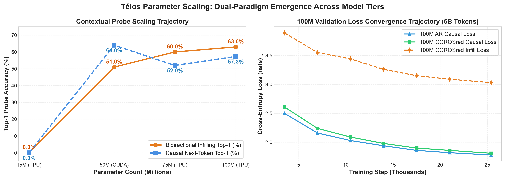

# Télos Research Papers & Scaling Studies

This directory contains research papers, scaling studies, and architecture notes for **télos** (τέλος) by **Wing It Research**.

  <a href="https://telos.research.wingit.tech"><strong>Research Portal: telos.research.wingit.tech</strong></a>
   
  <em>Note: The research portal is currently under active construction and is not finished yet.</em>

*Diagram status: Research figures are actively being finalized. Figures that match completed sweeps are embedded below. Additional figures still undergoing final formatting are marked as [Diagram: YET TO UPDATE].*

## Research Papers & Reports

| Document | Title | Summary |
| :--- | :--- | :--- |
| **[Paper 1: Token-Budget Scaling](paper_1_token_budget_scaling.md)** | *Preliminary Evidence on Token-Budget Scaling in Masked Diffusion Language Models for Code Autocomplete* | MDLM architecture definition, timestep distribution, token-to-parameter ratio scaling, and training dynamics. |
| **[Paper 2: Capability Divergence & RoPE](paper_2_capability_divergence_and_rope.md)** | *Capability Divergence, Positional Encoding, and the Limits of Masked Diffusion Scaling* | 12.5M, 25M, and 50M parameter sweeps, the CE-Rank divergence problem, and RoPE positional encoding findings. |
| **[COROSred Architecture](corosred_architecture.md)** | *Confidence-Routed Selective Re-Diffusion* | Combines causal autoregressive drafting with bidirectional masked infilling and confidence-guided re-diffusion. |

## Core Discoveries

### 1. Token-Budget Scaling
Masked Diffusion Language Models (MDLM) need different amounts of training data depending on their size:
- **12.5M model**: Best performance at a 1:20 token ratio (250M tokens).
- **25M model**: Best performance at a 1:30 token ratio (750M tokens).
- **50M model**: Best performance at a 1:35 token ratio (1.75B tokens).

  

### 2. The CE-Rank Divergence Problem
When training an MDLM for too long, the overall loss (cross-entropy) looks like it is still improving, but the model actually gets worse at predicting semantic tokens (like function names and variable names). The loss goes down only because simple syntax tokens (brackets, colons, keywords) are easy to guess.

  
  

### 3. Rotary Positional Embeddings (RoPE)
- Training with Rotary Positional Embeddings (RoPE) from the very start works well and yields strong top-5 prediction accuracy (17.82%).
- Trying to add RoPE to an already trained model with short fine-tuning causes performance to degrade (~0.6 nats worse).

  

### 4. COROSred Architecture Validation

  

*[Additional Infill / Category Ablation Diagrams: YET TO UPDATE]*
